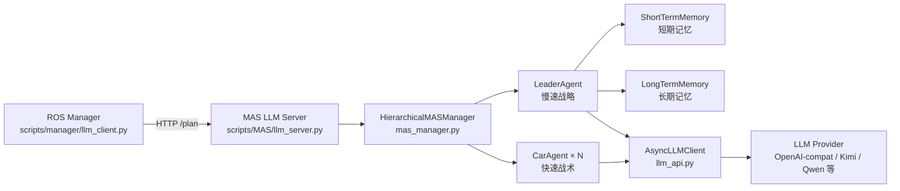
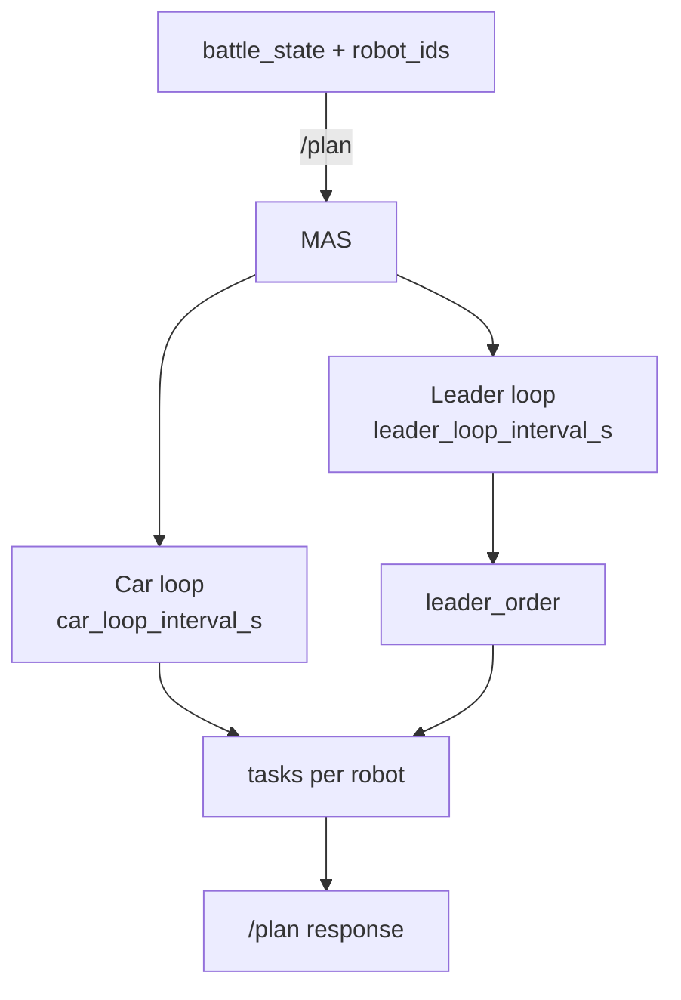

# MAS 多智能体系统技术文档

本文档聚焦 `scripts/MAS/` 目录的分层多智能体系统（MAS），涵盖总体架构、决策循环、配置与服务接口。ROS 侧的多机器人通信与裁判机制请参阅 → **[技术原理文档](TECHNICAL.md)**。

---

## 目录

- [1. 概览](#1-概览)
- [2. 架构总览](#2-架构总览)
- [3. 决策循环与数据流](#3-决策循环与数据流)
- [4. Agent 分层职责](#4-agent-分层职责)
- [5. 记忆系统](#5-记忆系统)
- [6. 任务输出格式](#6-任务输出格式)
- [7. 服务接口与接入方式](#7-服务接口与接入方式)
- [8. 配置与 Prompt](#8-配置与-prompt)
- [9. 目录结构](#9-目录结构)
- [10. 运行提示](#10-运行提示)

---

## 1. 概览

MAS 使用 **LeaderAgent（慢速战略）+ CarAgent（快速战术）** 的分层机制，将 LLM 输出转化为稳定的多车任务。  
Manager 通过 HTTP `/plan` 请求 MAS 服务，获取统一的 `tasks` 与 `leader_order`，并下发到 ROS 任务链路。

---

## 2. 架构总览



---

## 3. 决策循环与数据流



- **Leader loop**：低频生成全局战略指令与角色分配。
- **Car loop**：高频生成每台机器人动作任务，必要时复用最近结果以保证实时性。

---

## 4. Agent 分层职责

| 角色 | 频率 | 输入 | 输出 |
| --- | --- | --- | --- |
| LeaderAgent | 慢速（5~30s） | 战场全局状态 + STM/LTM | `leader_order`（纯文本） |
| CarAgent | 快速（1~5s） | `leader_order` + 单车局部状态 | 单车任务（action/target/mode/timeout） |

---

## 5. 记忆系统

- **STM（ShortTermMemory）**：滑动窗口记录最近战场状态，用于提示上下文摘要。
- **LTM（LongTermMemory）**：持久化战术摘要与策略记录，支持跨局复盘。
- **开关控制**：
  - `runtime.enable_ltm`（`scripts/MAS/configs/models.yaml`）
  - 环境变量：`MAS_DISABLE_LTM=1` / `MAS_ENABLE_LTM=1`

---

## 6. 任务输出格式

CarAgent 产出任务后，经 Manager 转换为 `TaskCommand` 下发。核心字段如下：

| 字段 | 说明 |
| --- | --- |
| `action` | `STOP` / `GOTO` / `ATTACK` / `ROTATE` |
| `target.x` `target.y` | 目标点坐标（GOTO/ATTACK） |
| `target.yaw` | 目标朝向（ROTATE 或 GOTO 可选） |
| `mode` | 战术模式（0 待机 / 1 巡逻 / 2 攻击） |
| `timeout` | 任务超时（秒） |

---

## 7. 服务接口与接入方式

### HTTP 接口

| 接口 | 方法 | 说明 |
| --- | --- | --- |
| `/health` | GET | 返回服务状态与 side 信息 |
| `/plan` | POST | 输入战场状态并返回任务 |

### /plan 请求与响应

- **请求**（来自 `scripts/manager/llm_client.py`）：
  - `battle_state`：Manager 格式化后的战场快照
  - `robot_ids`：本阵营机器人 ID 列表
- **响应**：
  - `tasks`：机器人 -> 任务字典
  - `leader_order`：全局战略文本
  - `meta`：周期与缓存信息

### Manager 接入

`config/manager/red_manager.yaml` 与 `blue_manager.yaml` 中的 `llm.service_url` 指向 `/plan`：

- red: `http://127.0.0.1:8001/plan`
- blue: `http://127.0.0.1:8002/plan`

---

## 8. 配置与 Prompt

| 位置 | 内容 |
| --- | --- |
| `scripts/MAS/configs/models.yaml` | LLM 模型与运行时参数 |
| `scripts/MAS/configs/prompts_*.yaml` | 通用 Prompt 模板 |
| `scripts/MAS/configs/red/` `blue/` | 阵营定制 Prompt |

常用环境变量：

- `MAS_PROMPTS_FILE` / `MAS_PROMPTS_FILE_RED` / `MAS_PROMPTS_FILE_BLUE`
- `MAS_PROMPTS_PATH`
- `MAS_DISABLE_LTM` / `MAS_ENABLE_LTM`
- `MAS_CONFIGS_ROOT`

运行时关键参数（`models.yaml`）：

- `leader_loop_interval_s`：Leader 循环周期
- `car_loop_interval_s`：Car 循环周期
- `team_ports.red/blue`：端口映射
- `enable_ltm`：是否启用 LTM

---

## 9. 目录结构

```
scripts/MAS/
├─ mas_manager.py          # 分层 MAS 管理器
├─ llm_server.py           # 双端口 HTTP 服务
├─ llm_api.py              # 异步 LLM 客户端
├─ agents/
│  ├─ leader_agent.py      # LeaderAgent
│  ├─ car_agent.py         # CarAgent
│  └─ prompt_dto.py
├─ memory/
│  ├─ stm.py               # ShortTermMemory
│  └─ ltm.py               # LongTermMemory
└─ configs/
   ├─ models.yaml
   ├─ prompts_3.2a.yaml
   └─ red/ blue/ ...
```

---

## 10. 运行提示

```bash
# 启动 MAS 双端口服务
bash config/AI/start_mas_services.sh
```

- 默认端口：red=8001、blue=8002  
- Prompt 日志：`debug/mas_llm_trace.log`（可通过环境变量关闭/分离）
